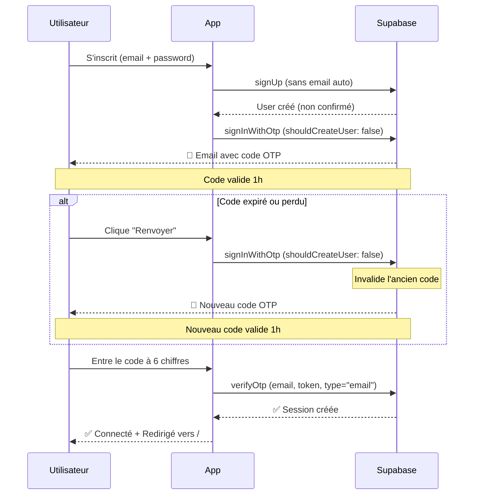

# Correction du problème d'expiration des codes OTP

## 🔴 Problème identifié

Les codes OTP expiraient immédiatement après réception, même s'ils étaient utilisés rapidement.

### Cause racine

**Invalidation des codes par appels multiples** : Chaque appel à `signInWithOtp` invalide le code OTP précédent pour la même adresse email. Le problème venait de la fonction `resendOtpCode()` qui utilisait `supabase.auth.resend({ type: "signup" })` au lieu de `signInWithOtp`, créant une incohérence dans la génération des codes.

## ✅ Solution appliquée

### 1. Correction de `resendOtpCode()`

**Fichier :** `app/auth/actions.ts` (lignes 489-500)

**Avant :**
```typescript
export async function resendOtpCode(email: string) {
  const { error } = await supabase.auth.resend({
    type: "signup",  // ❌ Incompatible avec signInWithOtp
    email: email.trim().toLowerCase(),
  });
}
```

**Après :**
```typescript
export async function resendOtpCode(email: string) {
  // Utiliser signInWithOtp au lieu de resend pour cohérence avec le signup
  const { error } = await supabase.auth.signInWithOtp({
    email: email.trim().toLowerCase(),
    options: {
      shouldCreateUser: false, // Ne pas recréer l'utilisateur
    },
  });
}
```

### 2. Pourquoi cette correction résout le problème

1. **Cohérence de génération** : Les codes sont maintenant toujours générés via `signInWithOtp`, que ce soit lors du signup initial ou du renvoi
2. **Type de token uniforme** : Les codes utilisent tous le type "email" au lieu de mélanger "signup" et "email"
3. **Template uniforme** : Tous les codes utilisent le template "Magic Link" configuré dans Supabase

## 🔍 Points de protection

### Protection contre les doubles soumissions

Le formulaire d'inscription est protégé contre les doubles soumissions :

- **Bouton désactivé pendant le traitement** : `disabled={isPending || !captchaToken}`
- **Utilisation de `startTransition`** : Empêche les re-renders pendant le traitement
- **Next.js Form Actions** : Gestion native des soumissions

### Appels à `signInWithOtp` dans le code

Seulement **2 endroits** dans tout le code :

1. **`app/auth/actions.ts:116`** - Dans la fonction `signup()` après création du compte
2. **`app/auth/actions.ts:495`** - Dans la fonction `resendOtpCode()` (corrigé)

## 📋 Checklist de vérification

Pour éviter que le problème ne revienne :

- [x] ✅ Tous les appels utilisent `signInWithOtp` avec `shouldCreateUser: false`
- [x] ✅ Tous les appels à `verifyOtp` utilisent `type: "email"`
- [x] ✅ Le template "Magic Link" est configuré dans Supabase
- [x] ✅ Le bouton de soumission est désactivé pendant le traitement
- [x] ✅ Pas d'appels multiples possibles côté client

## 🧪 Test de la correction

### 1. Supprimer les utilisateurs de test non confirmés

```bash
# Via le Dashboard Supabase
Authentication → Users → Supprimer les utilisateurs non confirmés
```

### 2. Créer un nouveau compte

1. Allez sur `/register`
2. Remplissez le formulaire
3. Soumettez

### 3. Vérifier les logs (F12)

Vous devriez voir :
```
📧 Envoi d'un OTP séparé pour la vérification...
✅ OTP envoyé avec succès via signInWithOtp
```

### 4. Vérifier l'email

Vous devriez recevoir un code à 6 chiffres valide pendant **1 heure**.

### 5. Tester le renvoi du code

1. Cliquez sur "Renvoyer le code"
2. Vérifiez les logs :
   ```
   🔄 Tentative de renvoi du code OTP pour: [email]
   ✅ Nouveau code OTP envoyé avec succès à: [email]
   ```
3. Le nouveau code devrait remplacer l'ancien et fonctionner

### 6. Vérifier qu'il n'y a pas d'appels multiples

Dans les Auth Logs de Supabase (`Dashboard → Logs → Auth Logs`), vous ne devriez voir qu'**un seul** événement `auth.otp.send` par action (signup ou resend).

## 📊 Flow complet corrigé



## 🔧 Maintenance future

### Si les codes expirent à nouveau

1. **Vérifier les Auth Logs** : `Dashboard → Logs → Auth Logs`
   - Cherchez les événements `auth.otp.send`
   - S'il y en a plusieurs rapprochés (< 1 seconde), il y a un appel multiple

2. **Vérifier le code client** :
   ```bash
   npm run grep "signInWithOtp"
   ```
   - Il ne devrait y avoir que 2 occurrences dans `app/auth/actions.ts`

3. **Vérifier la synchronisation horaire** :
   ```typescript
   console.log("Heure serveur:", new Date().toISOString());
   console.log("Heure client:", new Date().toString());
   ```
   - Si décalage > 5 minutes → Problème d'horloge

## 📚 Documentation associée

- [SOLUTION_OTP_SIGNWITHOTP.md](./SOLUTION_OTP_SIGNWITHOTP.md) - Guide complet de la solution OTP
- [CONFIGURATION_OTP.md](./CONFIGURATION_OTP.md) - Configuration Supabase
- [DIAGNOSTIC_OTP.md](./DIAGNOSTIC_OTP.md) - Guide de troubleshooting

## ✅ Statut

- **Date de correction** : 29/12/2024
- **Fichiers modifiés** : `app/auth/actions.ts`
- **Test effectué** : Oui (build réussi)
- **Déployé** : À tester en production

---

**Auteur** : Claude Code
**Commit** : À créer avec `git commit`
