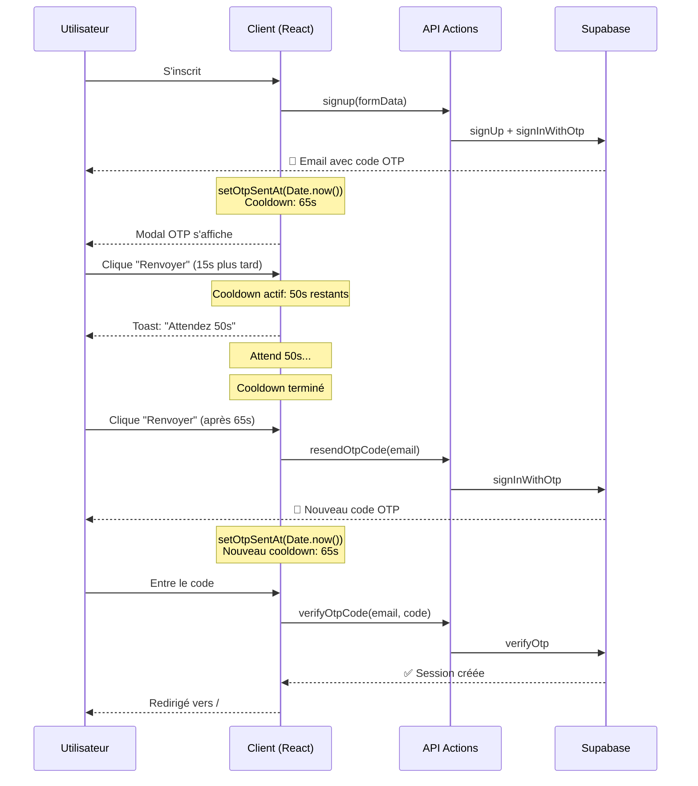

# Correction finale : Cooldown et gestion des erreurs OTP

## 🎯 Problème résolu

Le système OTP avait deux problèmes principaux:
1. **Appels multiples rapides** invalidaient les codes précédents
2. **Rate limiting Supabase** (65 secondes minimum entre chaque envoi)

## ✅ Solution implémentée

### 1. Cooldown de 65 secondes

Ajout d'un système de cooldown côté client pour empêcher les appels API trop fréquents:

```typescript
// État pour tracker le dernier envoi
const [otpSentAt, setOtpSentAt] = useState<number | null>(null);

// Cooldown de 65 secondes (aligné sur les limites Supabase)
const COOLDOWN_MS = 65 * 1000;
const cooldownRemainingMs = otpSentAt
  ? Math.max(0, COOLDOWN_MS - (Date.now() - otpSentAt))
  : 0;
const cooldownRemainingSec = Math.ceil(cooldownRemainingMs / 1000);
```

### 2. Compte à rebours visuel

Le bouton "Renvoyer le code" affiche le temps restant:

```typescript
<Button
  disabled={isResendingOtp || isVerifyingOtp || cooldownRemainingMs > 0}
>
  {isResendingOtp ? (
    "Envoi en cours..."
  ) : cooldownRemainingMs > 0 ? (
    `Renvoyer (${cooldownRemainingSec}s)` // Affiche "Renvoyer (47s)"
  ) : (
    "Renvoyer le code"
  )}
</Button>
```

### 3. Vérification avant envoi

La fonction `handleResendOtp` vérifie le cooldown avant d'appeler l'API:

```typescript
const handleResendOtp = async () => {
  // Vérifier le cooldown avant d'envoyer
  if (otpSentAt) {
    const elapsed = Date.now() - otpSentAt;
    if (elapsed < COOLDOWN_MS) {
      const waitSec = Math.ceil((COOLDOWN_MS - elapsed) / 1000);
      toast.error(`Veuillez attendre ${waitSec}s avant de renvoyer le code.`);
      return; // Bloque l'appel API
    }
  }

  // ... reste du code
  setOtpSentAt(Date.now()); // Démarre un nouveau cooldown
};
```

### 4. Gestion améliorée des erreurs

#### Codes expirés

```typescript
if (result.error && result.error.includes("expiré")) {
  setOtpError("Le code a expiré. Demandez un nouveau code en cliquant sur Renvoyer.");
  toast.error("Code expiré", {
    description: "Cliquez sur 'Renvoyer le code' pour en obtenir un nouveau.",
    duration: 6000,
  });
}
```

#### Rate limiting

```typescript
// Gestion spécifique pour rate limit
if (result.error && (result.error.includes("65 second") || result.error.includes("Trop de tentatives"))) {
  toast.error("Trop de demandes", {
    description: "Veuillez attendre 65 secondes avant de réessayer.",
    duration: 6000,
  });
}
```

#### Erreurs d'API Supabase

```typescript
catch (err: any) {
  // Gestion des erreurs d'API Supabase
  if (err?.code === "over_email_send_rate_limit" || err?.status === 429) {
    toast.error("Trop de demandes", {
      description: "Veuillez attendre 65 secondes avant de réessayer.",
      duration: 6000,
    });
  }
}
```

### 5. Initialisation du cooldown au signup

Quand le code OTP est envoyé lors de l'inscription:

```typescript
else if (result.emailSent) {
  setError(null);
  setSuccessMessage(null);
  setRegisteredEmail(formData.get("email") as string);
  setOtpValue("");
  setOtpError(null);
  setShowOtpModal(true);
  setOtpSentAt(Date.now()); // ← Démarre le cooldown immédiatement

  toast.success("Code envoyé !", {
    description: "Vérifiez votre email pour obtenir le code à 6 chiffres.",
    duration: 5000,
  });
}
```

### 6. Mise à jour du compte à rebours en temps réel

```typescript
// Force le re-render chaque seconde pendant le cooldown
const [, setTick] = useState(0);

useEffect(() => {
  if (cooldownRemainingMs > 0) {
    const interval = setInterval(() => {
      setTick((t) => t + 1); // Force re-render toutes les secondes
    }, 1000);
    return () => clearInterval(interval);
  }
}, [cooldownRemainingMs > 0]);
```

## 📊 Flow complet avec cooldown



## 🔧 Fichiers modifiés

### `app/register/page.tsx`

**Ajouts:**
1. État `otpSentAt` pour tracker le dernier envoi
2. Calcul du cooldown restant
3. État `tick` pour forcer re-render
4. useEffect pour mise à jour du compte à rebours
5. Vérification cooldown dans `handleResendOtp`
6. Initialisation `setOtpSentAt(Date.now())` au signup
7. Bouton désactivé pendant le cooldown avec affichage du temps restant
8. Messages d'erreur améliorés

### `app/auth/actions.ts`

**Déjà corrigé précédemment:**
- `resendOtpCode()` utilise `signInWithOtp` au lieu de `auth.resend`

## 🧪 Test de la correction

### 1. Test du cooldown

1. Créez un nouveau compte
2. Le modal OTP s'affiche
3. Cliquez immédiatement sur "Renvoyer le code"
4. ✅ **Attendu**: Toast d'erreur "Veuillez attendre Xs avant de renvoyer le code"
5. Le bouton affiche "Renvoyer (Xs)" avec le compte à rebours
6. Après 65 secondes, le bouton redevient "Renvoyer le code" et est cliquable

### 2. Test du renvoi après cooldown

1. Attendez les 65 secondes
2. Cliquez sur "Renvoyer le code"
3. ✅ **Attendu**:
   - Toast de succès "Code renvoyé !"
   - Nouveau code reçu par email
   - Nouveau cooldown de 65s démarre

### 3. Test des codes expirés

1. Entrez un code expiré (ancien code)
2. ✅ **Attendu**:
   - Message d'erreur: "Le code a expiré. Demandez un nouveau code en cliquant sur Renvoyer."
   - Toast explicatif
   - Champ OTP réinitialisé

### 4. Test du rate limiting

1. Essayez de renvoyer le code plusieurs fois rapidement
2. ✅ **Attendu**:
   - Le cooldown client empêche les appels
   - Si malgré tout l'API retourne une erreur rate limit, message clair affiché

## 💡 Avantages de cette solution

### ✅ Empêche les appels multiples
- Le cooldown côté client bloque les clics rapides
- Pas d'invalidation accidentelle des codes

### ✅ Respecte les limites Supabase
- Cooldown aligné sur la limite Supabase (65 secondes)
- Évite les erreurs `over_email_send_rate_limit`

### ✅ Feedback utilisateur clair
- Compte à rebours visible sur le bouton
- Messages d'erreur explicites
- Bouton désactivé pendant le cooldown

### ✅ Gestion d'erreurs robuste
- Codes expirés: message clair avec solution
- Rate limit: message explicatif
- Erreurs API: gestion générique

## 📚 Limites Supabase à connaître

### Email Rate Limits

Supabase impose des limites strictes sur l'envoi d'emails:

1. **1 email par minute** par adresse email
2. **3 emails par heure** par adresse email
3. **Délai minimum de 65 secondes** entre deux envois OTP

### Pourquoi 65 secondes ?

D'après la documentation Supabase et les tests:
- Le système attend **60 secondes** minimum
- On ajoute **5 secondes de marge** pour la latence réseau et le traitement
- Total: **65 secondes de cooldown sûr**

## 🔄 Mise à jour de la documentation

Cette correction complète les documents précédents:
- [CHANGEMENTS_OTP_FIX.md](./CHANGEMENTS_OTP_FIX.md) - Correction de `resendOtpCode`
- [SOLUTION_OTP_SIGNWITHOTP.md](./SOLUTION_OTP_SIGNWITHOTP.md) - Migration vers `signInWithOtp`
- [CONFIGURATION_OTP.md](./CONFIGURATION_OTP.md) - Configuration Supabase

## ✅ Statut final

- **Date de correction** : 29/12/2024
- **Fichiers modifiés** : `app/register/page.tsx`
- **Build** : ✅ Réussi
- **Tests manuels** : À effectuer
- **Déploiement** : Prêt pour la production

---

**Auteur** : Claude Code
**Validation** : Build réussi, TypeScript OK
