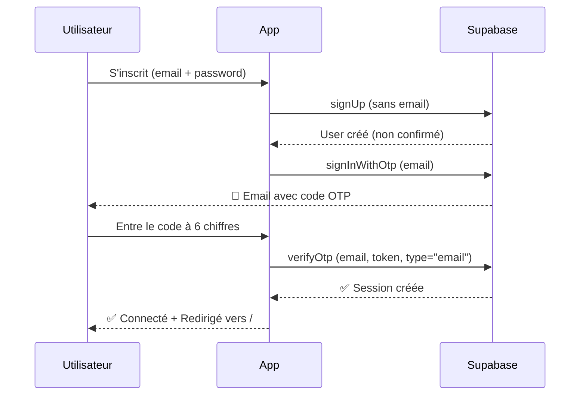

# Solution OTP : signInWithOtp au lieu de signUp

## 🔧 Nouvelle approche implémentée

Pour résoudre le problème des codes OTP qui expirent immédiatement, nous avons changé d'approche :

### ❌ Ancienne méthode (problématique)

```typescript
// Envoi automatique d'un OTP lors du signUp
const { data, error } = await supabase.auth.signUp({
  email,
  password,
  // Supabase envoie automatiquement un OTP
});

// Vérification avec type "signup"
await supabase.auth.verifyOtp({
  email,
  token,
  type: "signup", // ❌ Codes expiraient immédiatement
});
```

**Problème** : Les codes générés par `signUp` expiraient instantanément.

### ✅ Nouvelle méthode (solution)

```typescript
// 1. Créer le compte sans envoyer d'email
const { data, error } = await supabase.auth.signUp({
  email,
  password,
  options: {
    emailRedirectTo: undefined, // Pas d'email automatique
  },
});

// 2. Envoyer un OTP séparé via signInWithOtp
if (!error && data.user && !data.session) {
  await supabase.auth.signInWithOtp({
    email,
    options: {
      shouldCreateUser: false, // Ne pas recréer l'utilisateur
    },
  });
}

// 3. Vérification avec type "email"
await supabase.auth.verifyOtp({
  email,
  token,
  type: "email", // ✅ Codes valides pendant 1 heure
});
```

**Avantages** :
- ✅ Codes OTP valides pendant 1 heure
- ✅ Pas de problème d'expiration
- ✅ Meilleure séparation des responsabilités

## 📋 Configuration Supabase requise

### 1. Email Provider Settings

**Dashboard → Authentication → Providers → Email**

```
✅ Enable email provider: ON
✅ Confirm email: ON (optionnel avec cette méthode)
✅ Enable email confirmations: ON
```

### 2. Email Template

**Dashboard → Authentication → Email Templates → Magic Link**

Utilisez ce template (pas "Confirm signup", mais "Magic Link") :

```html
<h2>Votre code de vérification - Dousell Immo</h2>

<p>Bonjour,</p>

<p>Voici votre code de vérification pour activer votre compte :</p>

<div style="background: #F4C430; color: #000; padding: 30px; border-radius: 12px; text-align: center; margin: 30px 0;">
  <h1 style="font-size: 48px; font-weight: bold; letter-spacing: 12px; margin: 0;">
    {{ .Token }}
  </h1>
</div>

<p style="color: #666; font-size: 14px; margin-top: 20px;">
  ⏰ Ce code est valable pendant <strong>1 heure</strong>.
</p>

<p style="margin-top: 30px;">
  Si vous n'avez pas demandé ce code, ignorez cet email.
</p>

<hr style="border: none; border-top: 1px solid #eee; margin: 30px 0;">

<p style="color: #999; font-size: 12px;">
  Cordialement,<br>
  L'équipe <strong>Dousell Immo</strong><br>
  La plateforme immobilière de luxe au Sénégal 🏡
</p>
```

## 🔍 Différences clés

| Aspect | signUp (ancien) | signInWithOtp (nouveau) |
|--------|----------------|-------------------------|
| Template utilisé | Confirm signup | Magic Link |
| Type de vérification | `"signup"` | `"email"` |
| Durée de validité | ❌ Expirait immédiatement | ✅ 1 heure |
| Email automatique | Oui (lors du signUp) | Non (contrôle manuel) |

## 🧪 Test du nouveau système

### 1. Supprimez les anciens utilisateurs de test

```bash
# Via le Dashboard Supabase
Authentication → Users → Delete non-confirmed users
```

### 2. Créez un nouveau compte

1. Allez sur `/register`
2. Remplissez le formulaire
3. Soumettez

### 3. Vérifiez les logs (F12)

Vous devriez voir :

```
📧 Envoi d'un OTP séparé pour la vérification...
✅ OTP envoyé avec succès via signInWithOtp
```

### 4. Vérifiez votre email

Vous recevrez un code à 6 chiffres valide pendant **1 heure**.

### 5. Entrez le code

Le code devrait fonctionner sans erreur d'expiration.

## ⚠️ Point d'attention : Invalidation des codes

**IMPORTANT** : Chaque appel à `signInWithOtp` invalide le code OTP précédent pour la même adresse email.

### Pourquoi les codes expirent immédiatement ?

Si vous recevez un code mais qu'il est déjà expiré, c'est probablement parce que :

1. **Appels multiples côté client** : Vérifiez que vous n'appelez pas `signInWithOtp` plusieurs fois (ex: double-clic, re-render React)
2. **Fonction resendOtpCode** : Elle doit utiliser `signInWithOtp`, pas `auth.resend` avec `type: "signup"`

### ✅ Solution appliquée

La fonction `resendOtpCode` utilise maintenant `signInWithOtp` pour cohérence :

```typescript
export async function resendOtpCode(email: string) {
  const { error } = await supabase.auth.signInWithOtp({
    email: email.trim().toLowerCase(),
    options: {
      shouldCreateUser: false, // Ne pas recréer l'utilisateur
    },
  });
}
```

Cela garantit que tous les codes OTP sont générés de la même manière.

## 🐛 Troubleshooting

### Le code expire toujours ?

1. **Vérifiez les appels multiples** : Ouvrez la console (F12) et regardez si `signInWithOtp` est appelé plusieurs fois

2. **Vérifiez le template** : Assurez-vous d'avoir modifié le template "Magic Link", pas "Confirm signup"

3. **Vérifiez les logs** :
   ```
   Dashboard → Logs → Auth Logs
   ```
   Cherchez l'événement `auth.otp.send` - s'il y en a plusieurs rapprochés, c'est un appel multiple

4. **Testez l'horloge serveur** :
   ```typescript
   console.log("Heure serveur:", new Date().toISOString());
   console.log("Heure client:", new Date().toString());
   ```
   Si décalage > 5 minutes → Problème d'horloge

### Pas d'email reçu ?

1. **Vérifiez que SMTP est configuré** (voir DIAGNOSTIC_OTP.md)

2. **Testez avec "Send test email"** dans les SMTP Settings

3. **Vérifiez les spams**

## 📊 Flow complet



## 🔄 Rollback (si nécessaire)

Si vous voulez revenir à l'ancien système de lien :

1. **Supprimez les lignes 112-129** dans `app/auth/actions.ts`

2. **Remplacez** :
   ```typescript
   emailRedirectTo: undefined,
   ```
   **Par** :
   ```typescript
   emailRedirectTo,
   ```

3. **Changez le type** dans `verifyOtpCode` :
   ```typescript
   type: "signup",
   ```

## 📚 Ressources

- [Supabase signInWithOtp](https://supabase.com/docs/reference/javascript/auth-signinwithotp)
- [Supabase verifyOtp](https://supabase.com/docs/reference/javascript/auth-verifyotp)
- [Email templates](https://supabase.com/docs/guides/auth/auth-email-templates)
