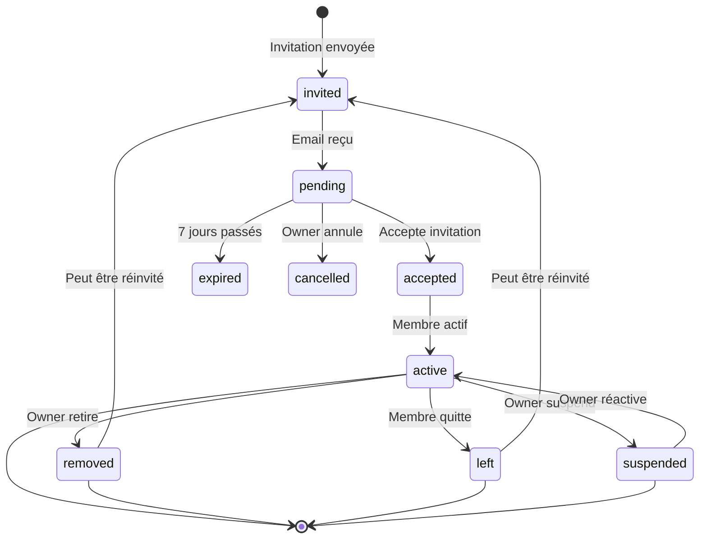

# Workflow d'Invitation et Permissions - Équipes Dousell Immo

> Date: 2026-02-01
> Status: ✅ Implémenté et testé

## 🔄 Workflow Complet: Invitation → Acceptation → Membre Actif

### 1. Invitation d'un nouveau membre

**Qui peut inviter?**
- `owner` ✅
- `manager` ✅
- `accountant` ❌
- `agent` ❌

**Process:**
1. Owner/Manager clique sur "Inviter" dans `/gestion/equipe`
2. Remplit le formulaire:
   - Email (obligatoire)
   - Rôle (manager, accountant, agent)
   - Message personnalisé (optionnel)
3. Server Action: `inviteTeamMember()`
   - Validation: Email valide, rôle autorisé
   - Vérification: Email pas déjà membre actif
   - Génération token unique + expiration 7 jours
   - Création entrée dans `team_invitations`
   - **Envoi email d'invitation** avec lien magique
   - Audit log: `member.invited`

**Email envoyé:**
```
Sujet: Invitation à rejoindre [Nom Équipe] sur Dousell Immo
Contenu:
- Nom de l'équipe
- Rôle proposé + description
- Message personnalisé
- Bouton "Accepter l'invitation" → lien avec token
- Expiration: 7 jours
```

---

### 2. Réception et visualisation de l'invitation

**Invité clique sur le lien:**
```
https://dousell-immo.com/gestion/equipe/invitations/accept?token=xxx
```

**Page `/gestion/equipe/invitations/accept`:**
1. Vérifie le token
2. Si pas connecté → Redirect `/login?redirect=...`
3. Si connecté → Affiche carte invitation avec:
   - Nom de l'équipe
   - Rôle proposé
   - Permissions du rôle
   - Message personnalisé
   - Date d'expiration

**Validations automatiques:**
- ❌ Token invalide → Redirect `/gestion/equipe?error=invalid_token`
- ❌ Invitation expirée → Affiche message avec date
- ❌ Invitation déjà acceptée → Redirect avec message
- ❌ Invitation annulée → Redirect avec message
- ⚠️ Email ne correspond pas → Affiche erreur et demande connexion avec bon compte

---

### 3. Acceptation de l'invitation

**Invité clique sur "Accepter l'invitation":**

Server Action: `acceptInvitation(token)`

**Process:**
1. Vérification authentification
2. Récupération invitation (via token)
3. Validations:
   - Email correspond ✅
   - Invitation status = pending ✅
   - Pas expirée ✅
4. Création membre dans `team_members`:
   ```sql
   INSERT INTO team_members (
     team_id,
     user_id,
     role,
     status = 'active',
     invited_by,
     joined_at = NOW()
   )
   ```
5. Mise à jour invitation:
   ```sql
   UPDATE team_invitations
   SET status = 'accepted', accepted_at = NOW()
   WHERE id = invitation.id
   ```
6. Audit log: `member.joined`
7. Redirect → `/gestion/equipe` (page équipe)

**Cas d'erreur:**
- Déjà membre (unique constraint) → `"Vous êtes déjà membre de cette équipe"`
- Invitation invalide → `"Invitation invalide ou expirée"`
- Email incompatible → `"Cette invitation n'est pas destinée à votre compte"`

---

### 4. Gestion des invitations en attente

**Sur la page `/gestion/equipe`:**

Section "Invitations en attente" affiche:
- Email invité
- Rôle proposé
- Date d'envoi
- Date d'expiration
- Status (En attente / Expirée)

**Actions disponibles (Owner/Manager):**

#### 4.1 Renvoyer l'invitation
- Bouton "Renvoyer"
- Server Action: `resendInvitation(teamId, invitationId)`
- Process:
  - Reset `expires_at` (+7 jours)
  - Reset `created_at` (timer visuel)
  - Status → `pending` (si était expirée)
  - **Envoi email de rappel**
  - Audit log: `member.invitation_resent`

**Email rappel:**
```
Sujet: Rappel - Invitation à rejoindre [Nom Équipe]
Contenu similaire + mention "Cette invitation a été renvoyée"
```

#### 4.2 Annuler l'invitation
- Bouton "Annuler"
- Server Action: `cancelInvitation(teamId, invitationId)`
- Process:
  - Status → `cancelled`
  - Audit log: `member.invitation_cancelled`
  - Invitation ne peut plus être acceptée

---

## 👥 Permissions par Rôle

### Matrice complète des permissions

| Action | Owner | Manager | Accountant | Agent |
|--------|-------|---------|------------|-------|
| **Gestion Équipe** |
| Voir les membres | ✅ | ✅ | ✅ | ✅ |
| Inviter membres | ✅ | ✅ | ❌ | ❌ |
| Changer rôle | ✅ | ❌ | ❌ | ❌ |
| Retirer membre | ✅ | ❌ | ❌ | ❌ |
| Renvoyer invitation | ✅ | ✅ | ❌ | ❌ |
| Annuler invitation | ✅ | ✅ | ❌ | ❌ |
| Paramètres équipe | ✅ | ❌ | ❌ | ❌ |
| **Gestion Locative** |
| Voir baux | ✅ | ✅ | ✅ | ✅ |
| Créer bail | ✅ | ✅ | ❌ | ❌ |
| Modifier bail | ✅ | ✅ | ❌ | ❌ |
| Résilier bail | ✅ | ✅ | ❌ | ❌ |
| Supprimer bail | ✅ | ❌ | ❌ | ❌ |
| **Finances** |
| Voir paiements | ✅ | ✅ | ✅ | ❌ |
| Confirmer paiement | ✅ | ✅ | ✅ | ❌ |
| Annuler paiement | ✅ | ✅ | ❌ | ❌ |
| Générer quittances | ✅ | ✅ | ✅ | ❌ |
| Rapports financiers | ✅ | ❌ | ✅ | ❌ |
| Gérer dépenses | ✅ | ❌ | ✅ | ❌ |
| **Maintenance** |
| Voir demandes | ✅ | ✅ | ❌ | ✅ |
| Créer demande | ✅ | ✅ | ❌ | ✅ |
| Approuver devis | ✅ | ✅ | ❌ | ❌ |
| Marquer complété | ✅ | ✅ | ❌ | ❌ |
| **Biens** |
| Voir biens | ✅ | ✅ | ❌ | ✅ |
| Créer bien | ✅ | ✅ | ❌ | ❌ |
| Modifier bien | ✅ | ✅ | ❌ | ❌ |
| Publier bien | ✅ | ✅ | ❌ | ❌ |
| Supprimer bien | ✅ | ❌ | ❌ | ❌ |

### Vérification des permissions (Code)

**Fichiers clés:**
- `lib/team-permissions.ts` - Définitions permissions (client-safe)
- `lib/permissions.ts` - Guards server-side
- `lib/team-context.ts` - Récupération contexte utilisateur

**Pattern utilisé dans Server Actions:**
```typescript
import { requireTeamPermission } from "@/lib/permissions";

export async function maServerAction() {
  // Vérifie permission + retourne contexte
  const { user, teamId, role } = await requireTeamPermission("team.members.invite");

  // Si pas les droits, exception levée automatiquement
  // Si droits OK, continue...
}
```

**Permissions définies** (`TEAM_PERMISSIONS`):
```typescript
{
  "team.members.invite": ["owner", "manager"],
  "team.members.remove": ["owner"],
  "team.members.edit_role": ["owner"],
  "leases.create": ["owner", "manager"],
  "payments.confirm": ["owner", "manager", "accountant"],
  // ... etc
}
```

---

## 🗄️ Structure Base de Données

### Table: `team_members`

```sql
CREATE TABLE team_members (
  id UUID PRIMARY KEY,
  team_id UUID REFERENCES teams(id) ON DELETE CASCADE,
  user_id UUID REFERENCES auth.users(id) ON DELETE CASCADE,
  role TEXT CHECK (role IN ('owner', 'manager', 'accountant', 'agent')),
  status TEXT CHECK (status IN ('active', 'suspended', 'invited', 'removed', 'left')),
  invited_by UUID REFERENCES auth.users(id),
  joined_at TIMESTAMPTZ,
  removed_at TIMESTAMPTZ,      -- ✅ Ajouté dans migration 20260201140000
  left_at TIMESTAMPTZ,          -- ✅ Ajouté dans migration 20260201140000
  created_at TIMESTAMPTZ DEFAULT NOW(),
  updated_at TIMESTAMPTZ DEFAULT NOW(),

  UNIQUE (team_id, user_id)
);

-- Index performances
CREATE INDEX idx_team_members_status ON team_members(status) WHERE status = 'active';
```

### Table: `team_invitations`

```sql
CREATE TABLE team_invitations (
  id UUID PRIMARY KEY,
  team_id UUID REFERENCES teams(id) ON DELETE CASCADE,
  email TEXT NOT NULL,
  role TEXT CHECK (role IN ('manager', 'accountant', 'agent')),
  token TEXT UNIQUE NOT NULL,
  status TEXT CHECK (status IN ('pending', 'accepted', 'expired', 'cancelled')),
  expires_at TIMESTAMPTZ NOT NULL,
  invited_by UUID REFERENCES auth.users(id),
  message TEXT,
  created_at TIMESTAMPTZ DEFAULT NOW(),
  accepted_at TIMESTAMPTZ
);

CREATE INDEX idx_team_invitations_token ON team_invitations(token);
CREATE INDEX idx_team_invitations_status ON team_invitations(team_id, status);
```

---

## 📋 Cycle de vie d'un membre



### Statuts possibles (MemberStatus):
- `invited` - Invitation en cours (pas encore dans team_members)
- `active` - Membre actif de l'équipe
- `suspended` - Temporairement suspendu (peut être réactivé)
- `removed` - Retiré par un owner (peut être réinvité)
- `left` - A quitté volontairement (peut être réinvité)

---

## 🔒 Sécurité et RLS (Row Level Security)

### Politiques RLS actives:

**team_members:**
```sql
CREATE POLICY "Team access for team_members"
ON team_members FOR ALL
USING (is_team_member(team_id))
WITH CHECK (is_team_member(team_id));
```

**team_invitations:**
- Les invitations utilisent le client Admin pour bypass RLS (opération sensible)
- Seuls owner/manager peuvent créer/gérer les invitations
- La validation est faite en Server Action

### Fonction helper:
```sql
CREATE FUNCTION is_team_member(p_team_id UUID) RETURNS BOOLEAN AS $$
  SELECT EXISTS (
    SELECT 1 FROM team_members
    WHERE team_id = p_team_id
    AND user_id = auth.uid()
    AND status = 'active'
  );
$$ LANGUAGE sql SECURITY DEFINER STABLE;
```

---

## ✅ Checklist Migration & Tests

### Migration Base de Données
- [x] Colonnes `removed_at` et `left_at` ajoutées
- [x] Contrainte CHECK pour statuts mis à jour
- [x] Trigger `updated_at` configuré
- [x] Index de performance créé

### Fonctionnalités
- [x] Invitation avec email envoyé
- [x] Page d'acceptation créée
- [x] Validations email/expiration
- [x] Bouton "Renvoyer" avec email
- [x] Bouton "Annuler" fonctionnel
- [x] Permissions vérifiées par rôle
- [x] Audit logs configurés

### À tester
- [ ] Inviter un nouveau membre (owner)
- [ ] Inviter un nouveau membre (manager)
- [ ] Accepter une invitation (email correct)
- [ ] Refuser une invitation
- [ ] Tenter d'accepter avec mauvais email
- [ ] Tenter d'accepter une invitation expirée
- [ ] Renvoyer une invitation
- [ ] Annuler une invitation
- [ ] Retirer un membre
- [ ] Réinviter un membre retiré

---

## 📧 Templates Email

### Email d'invitation initiale
**Fichier:** `app/(workspace)/gestion/equipe/actions.ts` (ligne ~565)

### Email de rappel
**Fichier:** `app/(workspace)/gestion/equipe/actions.ts` (ligne ~715)

### Variables d'environnement requises:
```env
NEXT_PUBLIC_SITE_URL=https://dousell-immo.com
GMAIL_USER=noreply@dousell-immo.com
GMAIL_APP_PASSWORD=xxx
```

---

## 🐛 Troubleshooting

### Problème: Email non reçu
1. Vérifier `GMAIL_USER` et `GMAIL_APP_PASSWORD`
2. Vérifier les logs serveur pour erreurs SMTP
3. Vérifier spam/courrier indésirable

### Problème: "Erreur lors de la suppression"
1. Vérifier que migration `20260201140000_add_member_lifecycle_columns.sql` est appliquée
2. Vérifier colonnes `removed_at` et `left_at` existent

### Problème: "Cet utilisateur est déjà membre"
1. Vérifier si membre avec status `removed` ou `left`
2. Peut être réinvité (validation filtre sur `status = 'active'`)

### Problème: 404 sur page d'acceptation
1. Vérifier que `/app/(workspace)/gestion/equipe/invitations/accept/page.tsx` existe
2. Redémarrer le serveur dev

---

**Dernière mise à jour:** 2026-02-01
**Version:** 1.0.0
**Auteur:** Claude Code Assistant
