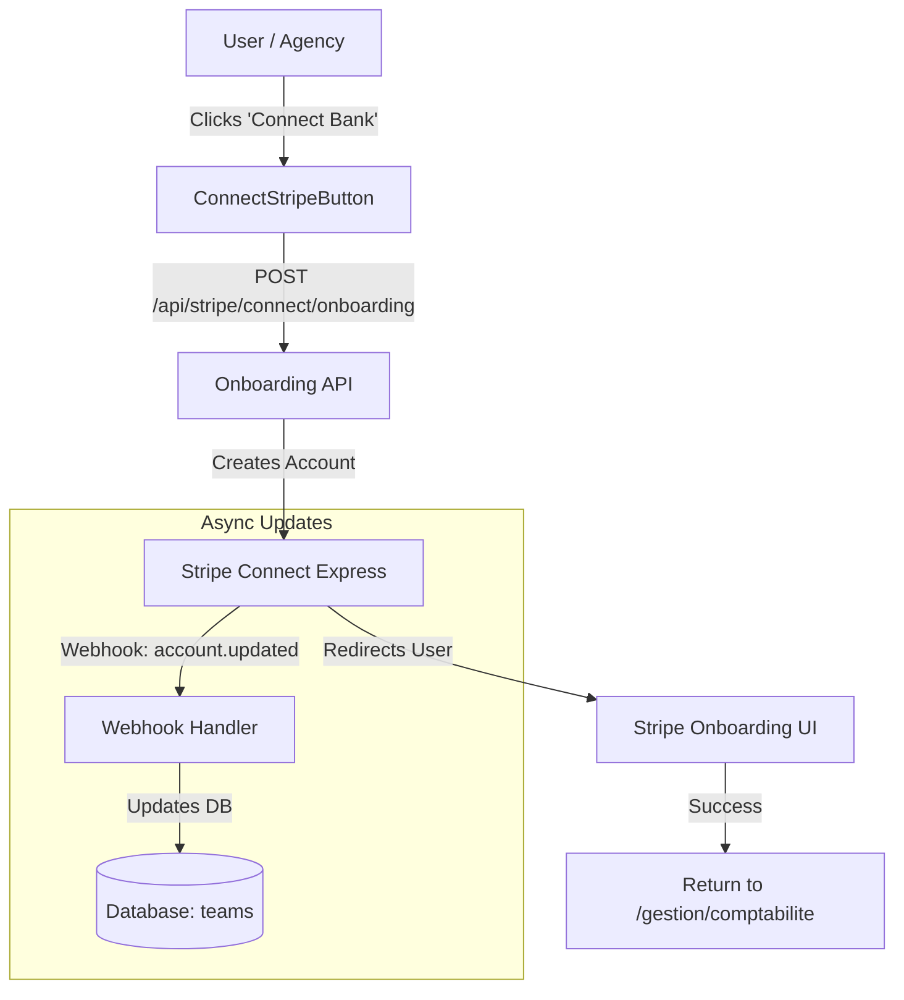

# Stripe Connect Integration (Hybrid SaaS + Marketplace)

## Overview
This document outlines the architecture for the Hybrid Model (C) implemented in Dousell Immo.
The goal is to enable agencies (Teams) to receive rent payments directly via Stripe Connect Express, while the platform takes a commission.

## Architecture



## Components Implemented

### 1. Database Schema (`public.teams`)
Additional columns track the Connect account status:
- `stripe_account_id` (Text, Unique): The Express Account ID (starts with `acct_...`).
- `stripe_charges_enabled` (Boolean): Can they process payments?
- `stripe_payouts_enabled` (Boolean): Can they receive money?
- `stripe_account_status` (Text): `pending`, `active`, or `restricted`.

### 2. Onboarding API (`app/api/stripe/connect/onboarding/route.ts`)
- **Role**: Initiates the onboarding process.
- **Logic**:
    1. Checks if `stripe_account_id` exists. If not, creates one.
    2. Generates an Account Link (`account_onboarding`).
    3. Returns the URL to redirect the user.

### 3. Webhook Handler (`app/api/webhooks/stripe/connect/route.ts`)
- **Role**: Listens for `account.updated` events from Stripe.
- **Why**: Essential for keeping DB in sync when KYC status changes or requirements are met.
- **Security**: Verifies signature using `STRIPE_CONNECT_WEBHOOK_SECRET`.

### 4. UI Component (`ConnectStripeButton.tsx`)
- **Location**: `app/(workspace)/gestion/comptabilite/components/ConnectStripeButton.tsx`.
- **Props**: `stripeAccountStatus`, `stripeChargesEnabled`, `stripePayoutsEnabled`.
- **Behavior**:
    - **Pending**: Shows "Connect Bank Account".
    - **Restricted**: Shows "Update Info" (redirects to Stripe to fix issues).
    - **Active**: Shows "Bank Account Connected" (Green badge).

## Setup Requirements (Environment Variables)

To make this work, you must configure the following in `.env.local`:

```env
# Stripe Keys (Already likely present)
NEXT_PUBLIC_STRIPE_PUBLISHABLE_KEY=pk_test_...
STRIPE_SECRET_KEY=sk_test_...

# Connect Configuration (NEW)
STRIPE_CONNECT_WEBHOOK_SECRET=whsec_...
# Get this from Stripe Dashboard > Developers > Webhooks > Add Endpoint
# Endpoint URL: https://your-domain.com/api/webhooks/stripe/connect
# Events to listen for: 'account.updated'
```

## Usage

1.  **Add the Button**:
    Import `ConnectStripeButton` in your page (e.g., `app/(workspace)/gestion/comptabilite/page.tsx`).
    Pass the team's Stripe status from the database.

2.  **Verify Webhook**:
    Ensure the webhook is active in Stripe Dashboard to receive updates.

3.  **Future: Payments**:
    When creating PaymentIntents for rent, use:
    ```typescript
    stripe.paymentIntents.create({
        amount: 500000, // 5000.00
        currency: 'eur',
        application_fee_amount: 5000, // Commission
        transfer_data: {
            destination: team.stripe_account_id,
        },
    });
    ```
